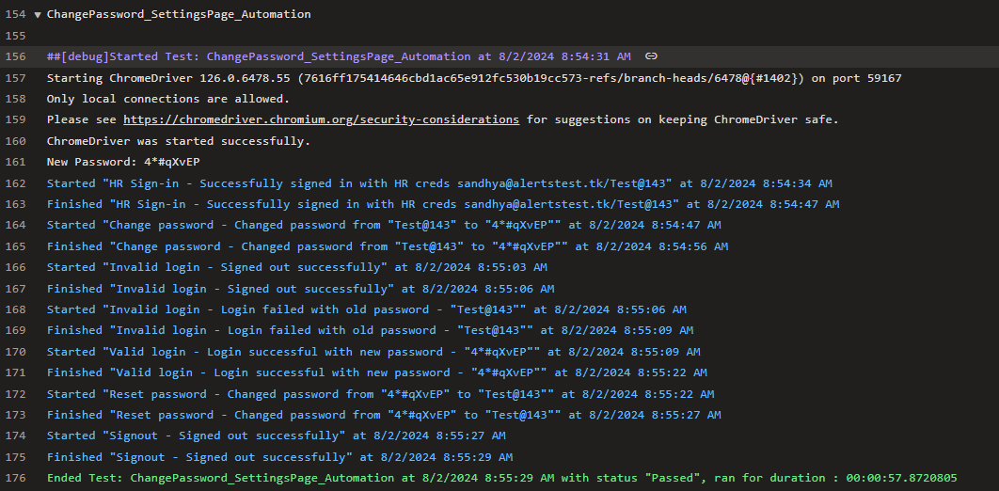

# Continuous Integration

## **Pipelines**

---

1. This project uses Azure Devops Pipelines for Continuous Integration.
1. There are multiple pipelines that are used to test in different environments whenever there are new releases. 
1. The [pipelines](https://onblickrigaps.visualstudio.com/Automation/_build){:target=_blank} are triggered based on `testCategory` - which are assigned to each test. 
	- The test categories are `Smoke`, `Sanity`, `Regression`, `Timesheets`, `NewFormI9` and so on and so forth. 
	- The pipelines are triggered based on the test category and the test environment (`demo`, `prod`, `dev` etc.,).
1. The pipelines are also named based on the test category and the test environment.
	- For example, [`Demo-Smoke`](https://onblickrigaps.visualstudio.com/Automation/_build?definitionId=244){:target=_blank}, [`Demo-Sanity`](https://onblickrigaps.visualstudio.com/Automation/_build?definitionId=197){:target=_blank}, [`Prod-Sanity`](https://onblickrigaps.visualstudio.com/Automation/_build?definitionId=200){:target=_blank} etc.,
1. Both [`Demo-Smoke`](https://onblickrigaps.visualstudio.com/Automation/_build?definitionId=244){:target=_blank} and [`Demo-Sanity`](https://onblickrigaps.visualstudio.com/Automation/_build?definitionId=197){:target=_blank} are scheduled to run Mon-Fri at `7:45 AM IST` and `8:30 AM IST` respectively.
1. All the other pipelines can only be triggered manually.

### Stages

---

1. The pipelines have multiple stages - but all stages are simliar/same between different pipelines.
1. The stages are:
	- `Initialize Job`: This stage initializes the job, install any tasks that are required and sets the variables required for the pipeline.
	- `Checkout`: This stage checks out the code from the repository.
	- `Initialize Report Folderpath`: This stage creates the folder structure for the test reports.
	- `Set Screen Resolution`: This stage sets the screen resolution for the tests.
	- `Install Dependencies`: This stage installs the dependencies (Restore NuGet Packages using `dotnet restore`) required for the tests.
	- `Build Solution`: This stage builds the solution using `dotnet build`.
	- `Run Tests`: This stage runs the tests using `dotnet test` and publishes the test run.
	- `Publish Extent Reports`: This stage publishes the test reports as artifacts.
	- `Cleanup Reports folder`: This stage cleans up the reports folder.
	- `Finalize Job`: This stage finalizes the job and cleans up any resources that are used.
	- `Report build status`: This stage sets the build status for the current commit.
1. The stages are executed in the order mentioned above.
1. The stages are executed in the same order for all the pipelines.

### Test Results

---

1. The test results are published to Azure Devops Pipelines.
1. The test results are published in the form of `Test Run` and `Test Result` in the Azure Devops Pipelines.
1. Here's what a test result would look like - 
	

### Test Reports

---

1. The test reports are published as Artifacts to Azure Devops Pipelines.
1. The test reports are published in the form of `HTML` files in the `ExtentReports` directory of the published artifacts for the build pipeline
1. To see an example of `Test Reports` go to [Example Report](reports.md/#report-example) in the Reports Section.

### Test Logs

---

1. You can view the test logs in the `Run Tests` task of the pipeline.
1. The logs are grouped by tests and also colored based on the test pass or fail status.
1. The logs also contain each test step from [`ExecuteStep`](../Utilities and Helpers/Pre-defined Utilities/testexecution-helper.md/#executestep) whenever the current step has started and finished.
1. All these logs are colored and grouped based on their status and tests so they are easy to read and understand.
1. Here's what the logs would look like - 
	

## **Email Notifications**

---

1. The pipelines are configured to send email notifications to the team whenever the pipeline finishes running.
1. The email notifications are sent to the team members who are part of the teams - `automationteam@onblick.com` and `qateam@onblick.com`.
1. The email notifications contain the test result and a link to the test run where you can also download the test report.