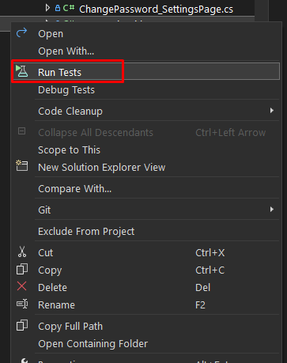
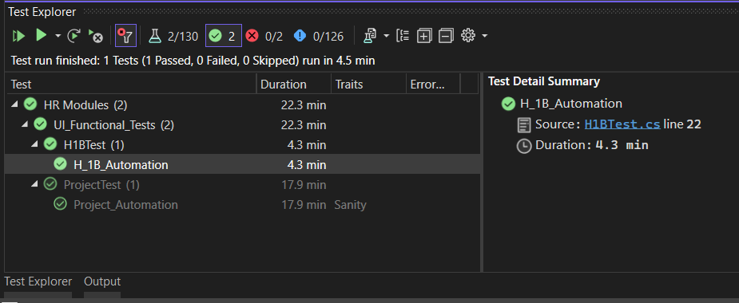

# Running Tests

Now that you've written your first test, let's run it. There are a couple ways you can run your test, one is using the `dotnet test` command in the CLI, and the other is using the Test Explorer in Visual Studio.

## **How to Run Tests**

---

=== "Using Test Explorer"
	1. Open the Test Explorer by going to `Test` > `Test Explorer` in the top menu.
	1. Click on the `Run All` button to run all the tests in the project.
	1. You can also run a single test by right-clicking on the test file and selecting `Run Tests`.
		

=== "Through CLI"
	```bash
	dotnet test
	```
	What this command will do is it will run all the tests in the current project. If you want to run a selected test, you can use the following command

	```bash
	dotnet test --filter FullyQualifiedName~TestName
	```
	Example: if your namespace is `MyNamespace` and your test name is `MyTest`, you can run the test using the following command

	```bash
	dotnet test --filter FullyQualifiedName~MyNamespace.MyTest
	```

## **Viewing Test Results**

---

- When you run your tests, you will see the output in the Test Explorer or in the CLI. The output will show you the status of each test, whether it passed or failed, and the time it took to run the test.

- If a test fails, the output will show you the reason for the failure, which will help you debug the issue.

  

- If all tests pass, you will see a green checkmark next to each test, indicating that the tests have passed successfully.
  
  