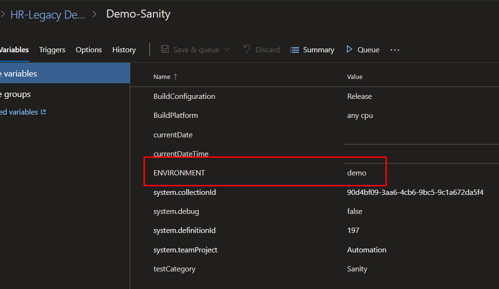

# Setting Up the Environment

## **Cloning the Repository**

---

To start working on the project, you need to clone the repository. You can do this using either the `git clone` command or the `Visual Studio` interface.

=== "Using Visual Studio"
	1. Open Visual Studio.
	2. Click on `Clone a repository`.
	3. Enter the repository URL `https://onblickrigaps.visualstudio.com/Automation/_git/Selenium2.0`.
	4. Click on `Clone`.

=== "Using Terminal"
	```bash
	git clone https://onblickrigaps.visualstudio.com/Automation/_git/Selenium2.0
	```

After cloning the repository, you are ready to proceed with the setup.

## **Configuring the Test Environment**

---

The environment in which tests run can be configured through the `Environment.cs` file. By default, the environment is set to `demo`.

### Updating the Environment Configuration

To set a different environment for your tests, update the `Name` property in the `Environment.cs` file with the desired environment value.

=== "Environment.cs"
	```csharp
	public static string Name => System.Environment.GetEnvironmentVariable("ENVIRONMENT") ?? "demo";
	```

### Supported Environment Values

The following environment values are available: 

=== "Allowed values for Environment variable"
	
	| Value | Description |
	| ---- | ----------- |
	| `demo` | Demo environment for testing purposes. |
	| `prod` | Production environment. |
	| `dev` | General development environment. |
	| `dev1` | First development environment. |
	| `dev2` | Second development environment. |

### Setting the Environment variable

To set the `ENVIRONMENT` variable, follow the instructions based on your operating system or pipeline configuration. This variable controls which environment the tests will execute against.



Ensure that the correct environment variable is set before running your tests to ensure they execute against the intended environment.